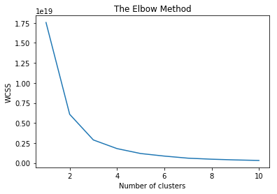
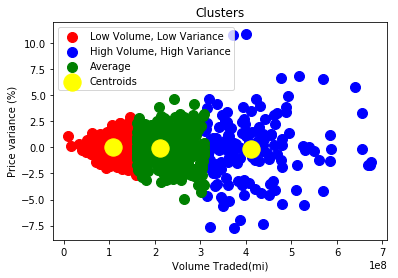
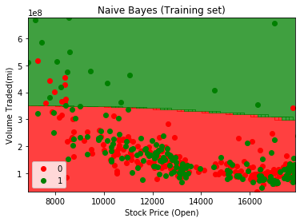

# Classifiers for Stock Prediction
For this exercise, we will create a model to predict if a given stock will increase or decrease based on the opening price and the volume traded.

After the model is created and the values predicted, we will select the last entry of the dataset (`Date = 2008-08-08`) and ask `Will the stock increase today?` and `Did we predict it correctly?`.

## The dataset
The dataset `DIJA_table.csv` observes the fluctuation of a stock price and volume across a period of time.   The data set was download from Kaggle https://www.kaggle.com/aaron7sun/stocknews#DJIA_table.csv

### Data points

The dataset has the following data points

* **Date** (date type with `YYYY-MM-DD` format)
    * The date in which the stock was observed
* **Open** (Float)
    * The stock's opening price for that day
* **High** (Float)
    * The highest price the stock reached for that day
* **Low** (Float)
    * The lowest price the stock reached for that day
* **Close** (Float)
    * The stock's closing price for that day
* **Volume** (Float)
    * The volume of stocks negotiated on that day
* **Adj Close** (Float)
    * The stock's adjusted closing price for that day

Alongside those variables already in the dataset, we will create two new data points:

* **Variance Percentage** (Float)
 * The price variance for the ay. This number can be positive or negative
* **Result** (int)
 * An int value to determine if the stock increased that day (`1`) or not (`0`)

For this classification we will focus on the `Volume` and `Open` variables and use to classify if the stock increased or not and we will use `Volume` and `Variance Percentage` to determine patterns on price variance.

## The Models

### K - MEANS

K-means clustering is a method of vector quantization, originally from signal processing, that is popular for cluster analysis in data mining. k-means clustering aims to partition n observations into k clusters in which each observation belongs to the cluster with the nearest mean, serving as a prototype of the cluster. [Wikipedia](https://en.wikipedia.org/wiki/K-means_clustering)


### Naïve Bayes

Naive Bayes is a simple technique for constructing classifiers: models that assign class labels to problem instances, represented as vectors of feature values, where the class labels are drawn from some finite set. There is not a single algorithm for training such classifiers, but a family of algorithms based on a common principle: all naive Bayes classifiers assume that the value of a particular feature is independent of the value of any other feature, given the class variable. [Wikipedia](https://en.wikipedia.org/wiki/Naive_Bayes_classifier)

## The Results

### Clustering

In order to know the amount of clusters to use, the `Elbow Method` was used. As it can e seen in the image below, the optimal number of clusters is **3**



Once we apply the K-means algorithm using three clusters, we get the following result


As it can be seen, the correlation between price variance and volume. That said, we have three distinct patterns.
* Low Volume, Low Variance
  * Days that falls into this category have less than 2 million stocks traded and present a very low variance in price. Usually within 2%

* Average
 * In this category, the stock has a volume between 2 and 3 million and the stock will not increase or decrease more than 5%.

* High Volume, High Variance
 * Whenever the stock volume surpasses 3 million, it starts behaving erratically and can have variances between -7.5% and 10%.


 ### Classification
 The classification method used for this dataset was the Naive Bayes and we got an **accuracy** of **55%** which proved to be a mediocre method for the columns selected. However, we were able to successfully predict the last entry of the dataset (`Date = 2008-08-08`).

```
Will the stock increase today? No
Did we predict it correctly? Yes
```

Below is the plotted graph of the prediction.

