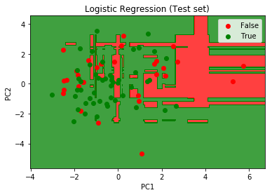

# Classifiers for Stock Prediction
For this exercise, we will create a model to predict if a student will pass it's class based on several factors and data available in the datase.

After the model is created and the values predicted, we will select the last student of the dataset (`Entry 394, Male Age 19`) and ask `Will the student pass the class?` and `Did we predict it correctly?`.

## The dataset
The dataset `student-mat.csv` observes several details. The data set was download from Kaggle  https://www.kaggle.com/dipam7/student-grade-prediction#student-mat.csv

### Data points

The dataset has the following data points

* school
 * student's school (binary: 'GP' - Gabriel Pereira or 'MS' - Mousinho da Silveira)
* sex
    * student's sex (binary: 'F' - female or 'M' - male)
* age
    * student's age (numeric: from 15 to 22)
* address
    * student's home address type (binary: 'U' - urban or 'R' - rural)
* famsize
    * family size (binary: 'LE3' - less or equal to 3 or 'GT3' - greater than 3)
* Pstatus
 * parent's cohabitation status (binary: 'T' - living together or 'A' - apart)
* Medu
 * mother's education (numeric: 0 - none, 1 - primary education (4th grade), 2 - 5th to 9th grade, 3 - secondary education or 4 - higher education)
* Fedu
    * father's education (numeric: 0 - none, 1 - primary education (4th grade), 2 - 5th to 9th grade, 3 - secondary education or 4 - higher education)
* Mjob
    * mother's job (nominal: 'teacher', 'health' care related, civil 'services' (e.g. administrative or police), 'at_home' or 'other')
* Fjob
    * father's job (nominal: 'teacher', 'health' care related, civil 'services' (e.g. administrative or police), 'at_home' or 'other')
* reason
    * reason to choose this school (nominal: close to 'home', school 'reputation', 'course' preference or 'other')
* guardian
    * student's guardian (nominal: 'mother', 'father' or 'other')
* traveltime
    * home to school travel time (numeric: 1 - <15 min., 2 - 15 to 30 min., 3 - 30 min. to 1 hour, or 4 - >1 hour)
* studytime
    * weekly study time (numeric: 1 - <2 hours, 2 - 2 to 5 hours, 3 - 5 to 10 hours, or 4 - >10 hours)
* failures
    * number of past class failures (numeric: n if 1<=n<3, else 4)
* schoolsup
    * extra educational support (binary: yes or no)
* famsup
    * family educational support (binary: yes or no)
* paidextra
    * paid classes within the course subject (Math or Portuguese) (binary: yes or no)
* activities
    * extra-curricular activities (binary: yes or no)
* nursery
    * attended nursery school (binary: yes or no)
* higher
    * wants to take higher education (binary: yes or no)
* internet
    * Internet access at home (binary: yes or no)
* romantic
    * with a romantic relationship (binary: yes or no)
* famrel
    * quality of family relationships (numeric: from 1 - very bad to 5 - excellent)
* freetime
    * free time after school (numeric: from 1 - very low to 5 - very high)
* goout
    * going out with friends (numeric: from 1 - very low to 5 - very high)
* Dalc
    * workday alcohol consumption (numeric: from 1 - very low to 5 - very high)
* Walc
    * weekend alcohol consumption (numeric: from 1 - very low to 5 - very high)
* health
    * current health status (numeric: from 1 - very bad to 5 - very good)
* absences
    * number of school absences (numeric: from 0 to 93)
* G1
    * first period grade (numeric: from 0 to 20)
* G2
    * second period grade (numeric: from 0 to 20)
* G3
    * final grade (numeric: from 0 to 20)

For this classification we will use all data points except `school`, `G1`, `G2` and `G3`. Furthermore, several data points had to be preprocessed and some categorial data was encoded.

## The Models

### PCA

Principal component analysis (PCA) is a statistical procedure that uses an orthogonal transformation to convert a set of observations of possibly correlated variables (entities each of which takes on various numerical values) into a set of values of linearly uncorrelated variables called principal components. [Wikipedia](https://en.wikipedia.org/wiki/Principal_component_analysis)


### XGBoost

Gradient boosting is a machine learning technique for regression and classification problems, which produces a prediction model in the form of an ensemble of weak prediction models, typically decision trees. It builds the model in a stage-wise fashion like other boosting methods do, and it generalizes them by allowing optimization of an arbitrary differentiable loss function. [Wikipedia](https://en.wikipedia.org/wiki/Gradient_boosting)

### Logistic Regression

In statistics, the logistic model (or logit model) is used to model the probability of a certain class or event existing such as pass/fail, win/lose, alive/dead or healthy/sick. This can be extended to model several classes of events such as determining whether an image contains a cat, dog, lion, etc... Each object being detected in the image would be assigned a probability between 0 and 1 and the sum adding to one. [Wikipedia](https://en.wikipedia.org/wiki/Logistic_regression)

## The Results

### Classification
The classification method used for this dataset was the `Logistic Regression` allied with `PCA` and `XGBoost` and we got an **accuracy** of **61%** which proved to be an average model for this datase. However, we were able to successfully predict the last entry of the dataset (`Entry 394, Male Age 19`).

```
Will the student pass the class? No
Did we predict it correctly? Yes
```

Below is the plotted graph of the prediction.

